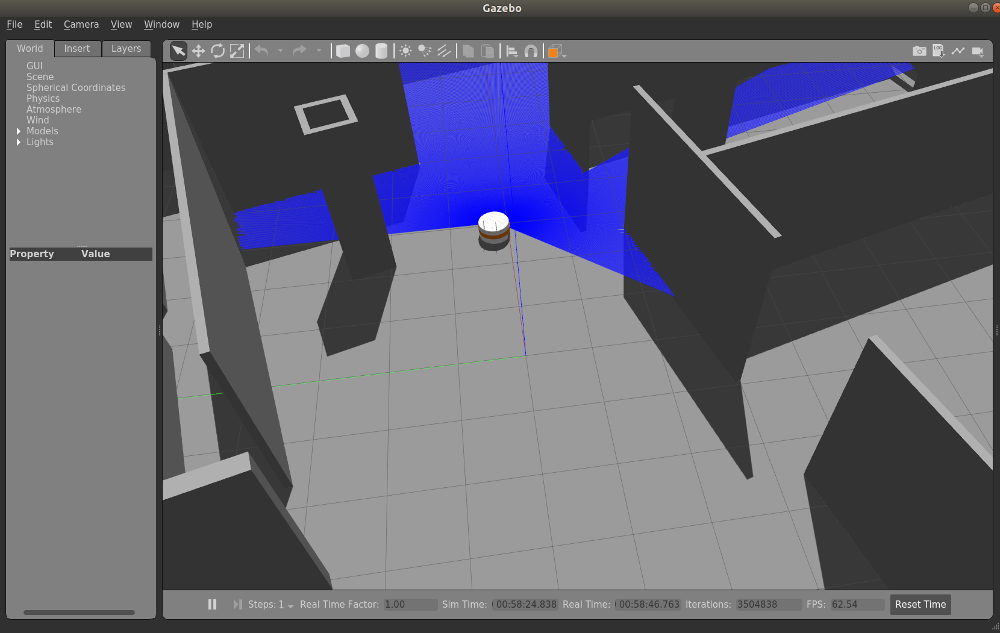
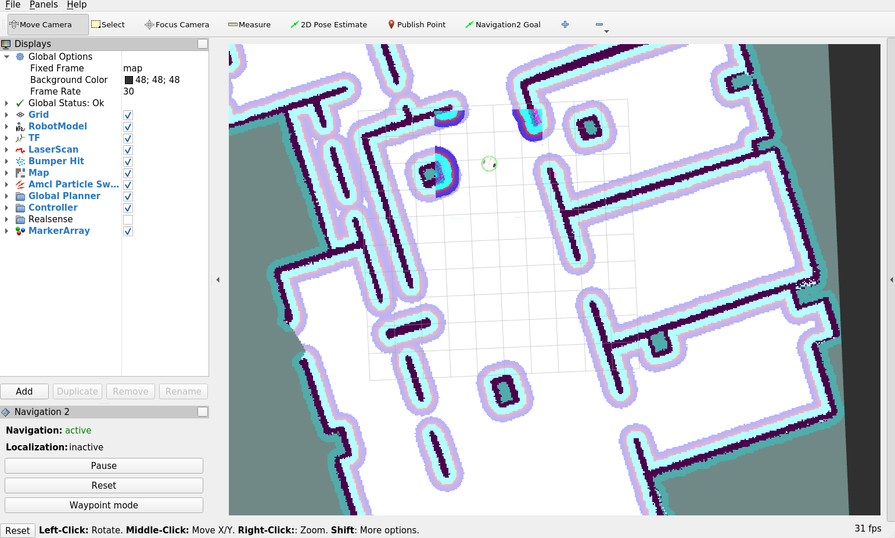

# PMB-2 Mapping tutorial ROS2


## Purpose

This tutorial shows how to make PMB-2 navigate autonomously provided a map build up of laser scans and taking into account the laser and the RGBD camera in order to avoid obstacles.

## Pre-Requisites

First make sure that the tutorials are properly installed along with the PMB-2 simulation, as shown in the [Tutorials Installation](http://wiki.ros.org/Robots/PMB-2/Tutorials#Tutorials_Installation) Section. Then follow the instructions in the  [nav2 SLAM tutorial](https://navigation.ros.org/tutorials/docs/navigation2_with_slam.html) in order to create and save a map.

## Execution

First of all open two consoles and source PMB-2's public simulation workspace in each one
```
cd ~/pmb2_public_ws
source ./install/setup.bash
```
In the first console launch the following simulation
```
ros2 launch pmb2_2dnav_gazebo pmb2_mapping_gazebo.launch.py
```


Note that a rviz will also show up in order to visualize the mapping process.



In the second console launch the keyboard teleoperation node
```
ros2 run teleop_twist_keyboard teleop_twist_keyboard --ros-args --remap cmd_vel:=key_vel
```


As shown in the [nav2 SLAM tutorial](https://navigation.ros.org/tutorials/docs/navigation2_with_slam.html) you can save the map by doing:

```
ros2 run nav2_map_server map_saver_cli -f ~/map
```
